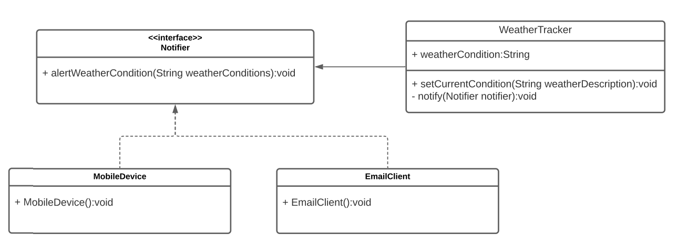

# Simple implementation of IoC/DI container

## What is DI and IoC
[IoC/DI container](https://martinfowler.com/articles/injection.html)

**Dependency inversion principle (DIP)** - 
 1. High level classes should not depend upon low level classes. Both should depend upon abstractions.

 2. Abstractions should not depend upon details. Details should depend upon abstractions.

This is principle says the rules that we should stick to get rid strong dependency relation.



> [!NOTE]
> Class dependencies must be located at the current or higher level of abstraction. In other words, not every class that requires an interface in the constructor follows the dependency inversion principle.
>
> https://sergeyteplyakov.blogspot.com/2014/11/di-vs-dip-vs-ioc.html

**Dependency injection (DI)** - specific technicue when responsibility to create module is outside of the class (passed already created dependency)

**DI** have three type of containers. 
- contsructor injection (dependencies provided from constructor)
- setter injection (dependencies provided from setter)
- interface injection


**What is difference?**
DIP is principle for architechture of the application.
DI is a specific technicue implementation of the DIP.


We are gonna implement **constructor** injection container.

## IOC/DI-container


```c++
IOCContainer container;

container.registerInstance<IFoo, Foo>();
auto foo = container.resolve<IFoo>();
foo->hello();
```

Registered `Foo` to `IFoo` instance and we next time call resolve `IFoo` it gives us registered to it `Foo` instance.

The main goal of this architechture is to avoid this type of cases:
```c++
class IConsole {
    virtual void log(string msg) = 0;
};
class Console : IConsole {
    Console(IWriter*, IPrinter*) {};
    void log(string msg) override {}
};


IConsole* c = new Console(new Writer(), new Printer(new Foo()))
```

Using this architechture we just need resolve `Console`
```c++
IOCContainer container;

// configure
container.registerInstance<IWriter, Writer>();
container.registerInstance<IFoo, Foo>();

container.registerFactory<IPrinter, Printer, IFoo>();
container.registerFactory<IConsole, Console, IWriter, IPrinter>();

// resolve console
IConsole* c = container.resolve<IConsole>();
c->log("di");
```

# Problems
- [x] If `GetObject` is not find instance app crushing
- [x] Cannot construct object with non inject arguments
- [x] Circular dependencies (deadlock)
    ```c++
    class Foo : public IFoo {
        Foo(IBar* IBar) { ... }
    };
    class Bar : public IBar {
        Bar(IFoo* IFoo) { ... }
    };
    ```

    Cons of constructor injections method. We cannot create `Foo` w/o `Bar` and `Bar` w/o `Foo`. In `Container::registerInstance` we need to **prevent** this type of dependencies.

    But if we'd like to solve this need to use setter injections method.
    ```c++
    class Foo : public IFoo {
        void setBar(Bar* Bar) { ... }
    };
    class Bar : public Bar {
        void setFoo(IFoo* IFoo) { ... }
    };
    ```


https://en.cppreference.com/w/cpp/memory/shared_ptr/pointer_cast

https://en.cppreference.com/w/cpp/types/type_index

https://en.cppreference.com/w/cpp/language/pack

https://en.cppreference.com/w/cpp/utility/functional/function

https://sergeyteplyakov.blogspot.com/2014/11/di-vs-dip-vs-ioc.html

